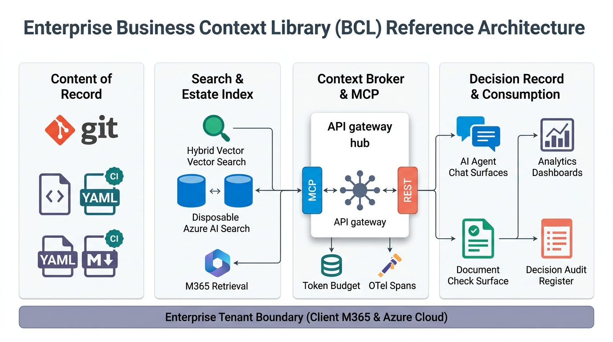
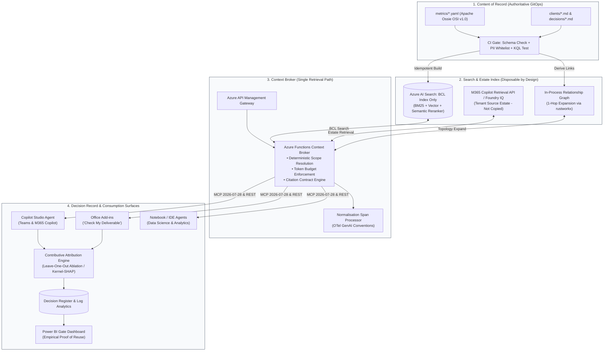
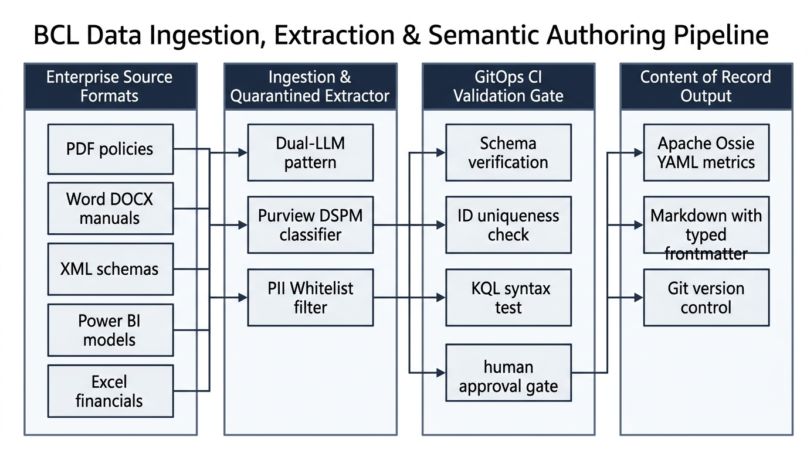
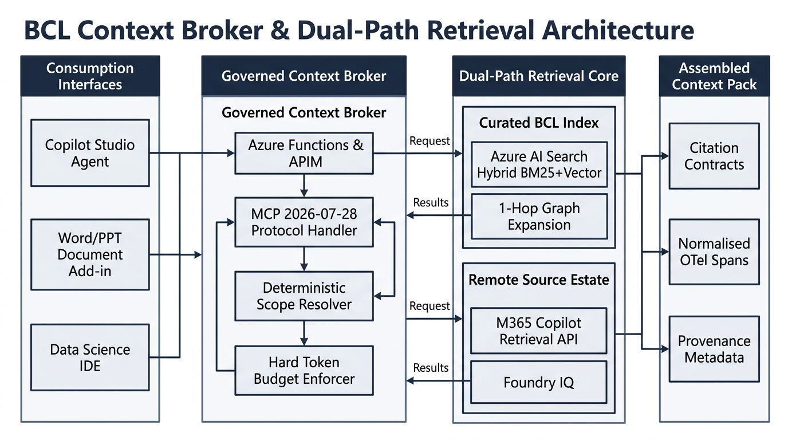
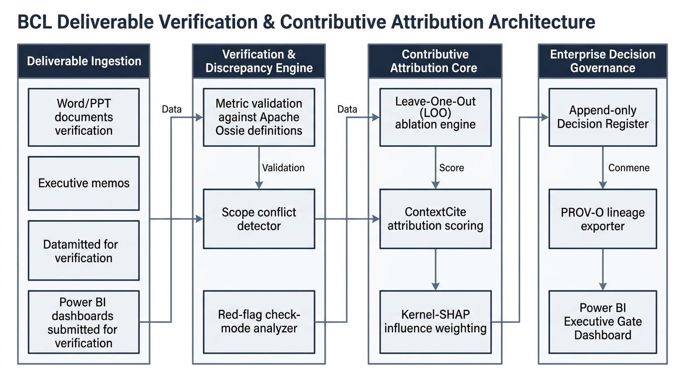

# Enterprise Business Context Library (BCL) & Technical Due-Diligence Architecture

[](#1-executive-thesis-the-3-record-model)
[](https://github.com/apache/ossie)
[](https://spec.modelcontextprotocol.io)
[](#6-universal-due-diligence--adversarial-verification-framework)
[](#7-security-governance--compliance-boundaries)

An enterprise reference architecture, RFP response design, and adversarial due-diligence framework for the **Business Context Library (BCL)**. This repository establishes a governed, vendor-neutral semantic layer and context-brokering infrastructure operating entirely within an enterprise Microsoft 365 and Azure tenant boundary.

---

## 1. Executive Thesis: The 3-Record Model

Enterprise generative AI and RAG initiatives consistently fail when they conflate storage with business meaning, build bespoke retrieval pipelines that cloud providers commoditize, or rely on vanity retrieval metrics that fail to demonstrate tangible business value.

This architecture resolves those failure modes by enforcing **Three Records, Not One**:

```
 ┌────────────────────────────────┐     ┌────────────────────────────────┐     ┌────────────────────────────────┐
 │       CONTENT OF RECORD        │     │        INDEX OF RECORD         │     │        DECISION RECORD         │
 │ (Portable, GitOps-Governed)    │ ──► │ (Disposable, Ephemeral Search) │ ──► │ (Measurable Business Adoption) │
 │ Markdown + Apache Ossie YAML   │     │ Azure AI Search Curated BCL    │     │ Attribution Scoring & Registry │
 └────────────────────────────────┘     └────────────────────────────────┘     └────────────────────────────────┘
```

1. **A Content of Record You Can Walk Away With:** A Git-backed SharePoint repository storing human-diffable Markdown alongside open-standard **Apache Ossie (OSI v1.0)** YAML schemas. This guarantees full exit portability and vendor independence.
2. **An Index of Record You Can Throw Away and Rebuild:** A compact, disposable Azure AI Search index covering strictly curated BCL entries (thousands, not millions). It reaches the broader corporate estate through native remote platform retrieval (M365 Copilot Retrieval API / Microsoft Foundry IQ) without duplicating tenant data.
3. **A Decision Record That Proves Real Adoption:** Mathematical **contributive context attribution** (leave-one-out ablation / Kernel-SHAP) paired with an immutable decision audit register, proving measurable ROI on executive Power BI gate dashboards.

---

## 2. High-Level Reference Architecture

### Architectural Blueprint (16:9 Enterprise Widescreen)



### The 4 Vertical Pillars & Foundation Plane

| Pillar | Core Technologies | Primary Function | Operational Guarantees |
|---|---|---|---|
| **Zone 1: Content of Record** | Git, Markdown, Apache Ossie (OSI v1.0) YAML, CI Pipelines | Authoritative single source of truth for metrics, client profiles, and decision logs. | Strict GitOps write-path; automated CI validation (YAML schema compliance, PII whitelisting, ID uniqueness, KQL syntax checks). |
| **Zone 2: Search & Estate Index** | Azure AI Search, M365 Copilot Retrieval API, Foundry IQ, In-Process Graph | Permission-trimmed hybrid retrieval across curated context and the broader enterprise estate. | 100% disposable index; zero duplicate document storage; document-level ACLs enforced natively by platform services. |
| **Zone 3: Context Broker & MCP** | Azure Functions, Azure API Management, MCP (`2026-07-28`), REST | Centralized context retrieval, prompt assembly, and token budget governance. | Deterministic scope resolution, hard token limits, Normalisation Span Processor for OpenTelemetry GenAI semantic conventions. |
| **Zone 4: Decision Record & Consumption** | Copilot Studio, Office Add-ins, Log Analytics, Power BI | Multi-surface agent consumption paired with empirical reuse measurement. | Validates adoption via contributive attribution (ContextCite / LOO ablation) and immutable decision registers. |
| **Horizontal Foundation** | Enterprise Tenant Boundary (Client M365 & Azure Subscription) | Full data sovereignty and zero supplier-hosted components in the critical path. | Complete exit portability; all keys, data, and compute execute within the client's corporate cloud boundary. |

---

### Interactive System Topology & Data Flow



---

## 3. Detailed Operational Flows (Draw.io / Visio Blueprint Views)

To provide technical clarity for enterprise architects, data engineers, and executive stakeholders, the architecture decomposes into three sequential operational flows:

### Flow 1: Data Ingestion, Extraction & Semantic Authoring Pipeline
*How multi-format enterprise assets and BI models are ingested safely, verified via GitOps, and standardized into the open specification.*



1. **Enterprise Source Ingestion:** Ingests unstructured policy documents (PDFs, compliance guides), operational manuals (Word DOCX), data contracts (XML/JSON schemas), Power BI semantic models, and Excel financial worksheets.
2. **Quarantined Extraction & Security:**
   * **Dual-LLM Pattern:** A quarantined, tool-less extraction model isolates raw content to mitigate prompt injection risks.
   * **Purview DSPM Classification:** Enforces organizational sensitivity labels and flags overshared documents before indexing.
   * **PII Whitelist Enforcement:** Strips sensitive personnel details, allowing only pre-approved attributes (`person.name` and `person.reports_to`).
3. **GitOps CI Validation Gates:** Every commit undergoes automated schema verification against Apache Ossie rules, canonical ID uniqueness checks, cross-reference markdown link audits, KQL syntax validations, and formal human approval checkpoints.
4. **Content of Record Output:** Generates clean, version-controlled repository assets consisting of `metrics/*.yaml` (Apache Ossie OSI v1.0 standard) and `clients/*.md` with typed YAML frontmatter.

---

### Flow 2: Governed Context Broker & Dual-Path Retrieval Architecture
*How user queries resolve deterministically across curated context and the client's broader M365 tenant estate without duplicate storage.*



1. **Unified Consumption Interfaces:** Agents in Microsoft Teams/Copilot Studio, Microsoft Office Add-ins (*"Check My Deliverable"*), and Data Science IDEs issue requests over the standardized **Model Context Protocol (MCP `2026-07-28`)** and REST APIs.
2. **Context Broker Engine (Azure Functions + APIM):**
   * **Deterministic Scope Resolver:** Maps incoming queries to specific business domains, Lines of Business (LoBs), and client accounts.
   * **Hard Token Budget Enforcer:** Allocates and bounds context packs to prevent token accumulation and costly multi-turn bloat.
3. **Dual-Path Retrieval Execution:**
   * **Curated BCL Index:** Disposable Azure AI Search (Hybrid BM25 lexical search + dense vector embeddings + cross-encoder semantic reranker) supplemented with an in-process 1-hop relationship graph (`rustworkx`).
   * **Remote Source Estate:** Queries the broad tenant estate via the native M365 Copilot Retrieval API and Microsoft Foundry IQ with tenant-native user ACL trimming.
4. **Assembled Context Pack:** Bundles verified context with citation contracts, provenance tracking, and telemetry spans normalized for OpenTelemetry GenAI standards.

---

### Flow 3: Deliverable Verification, Contributive Attribution & Decision Governance
*How deliverables are audited against ground truth and how the client measures genuine business impact to satisfy the December gate.*



1. **Deliverable Ingestion:** Consultants, auditors, and analysts submit business deliverables (Word proposals, PowerPoint decks, executive memos, Power BI dashboards) for automated verification.
2. **Verification & Discrepancy Engine:** Compares claims and metrics directly against authoritative Apache Ossie definitions, identifies scope conflicts, and performs automated check-mode discrepancy analysis.
3. **Contributive Attribution Core:**
   * Replaces misleading raw retrieval hits with **Leave-One-Out (LOO) ablation** (ContextCite / Kernel-SHAP).
   * Quantifies the mathematical delta that BCL context contributed to the output versus pre-trained model baselines.
4. **Enterprise Decision Governance:** Appends immutable verification entries to an append-only Decision Register in Log Analytics, generates W3C PROV-O audit graphs, and surfaces empirical adoption evidence on the **Power BI Executive Gate Dashboard**.

---

## 4. The Five Findings That Changed the Answer

The architecture rejects unverified assumptions in favor of verified 2026 production baselines:

1. **Microsoft Delivered the Architecture Layer in June 2026 (Foundry IQ & Fabric IQ):**
   * *Reality:* Microsoft shipped Foundry IQ as a managed knowledge layer connecting structured and unstructured data with query-time ACL enforcement.
   * *Strategic Move:* Avoid building bespoke ingestion/indexing plumbing that Microsoft commoditizes. **Buy the plumbing, build the meaning, own the measurement.**
2. **Apache Ossie (OSI v1.0) Standardizes Semantic Metrics:**
   * *Reality:* The Open Semantic Interchange specification was donated to the Apache Software Foundation in June 2026 as **Apache Ossie** (`github.com/apache/ossie`).
   * *Strategic Move:* Author the **Metrics & KPIs** domain as Ossie-shaped YAML from day one. This makes semantic metric forks machine-detectable in CI rather than an elusive discovery exercise.
3. **M365 Copilot Retrieval API is Delegated-Auth Only:**
   * *Reality:* The v1.0 Retrieval API enforces a 200 req/user/hour quota and **does not support application permissions**.
   * *Strategic Move:* A batch "check every deliverable at midnight" job cannot use this API. Automated deliverable verification must query the BCL's disposable Azure AI Search index directly via app permissions, while interactive checking runs through the user-delegated path.
4. **Re-Indexing the Source Estate is a Compliance Liability:**
   * *Reality:* Azure AI Search SharePoint indexers lack support for tenants with Entra ID Conditional Access enabled and cap ACL entries per file.
   * *Strategic Move:* Index strictly the curated BCL entries; reach the broader estate solely through native remote platform retrieval.
5. **Retrieval Logs Cannot Measure Reuse:**
   * *Reality:* Counting retrieval API hits inflates adoption metrics by 10× because models often ignore injected context chunks.
   * *Strategic Move:* Implement **contributive context attribution** (leave-one-out ablation / ContextCite) to mathematically quantify which BCL entries directly impacted agent outputs.

---

## 5. Repository Document Catalog

This repository houses the complete RFP proposal, technical due-diligence audits, and specialized adversarial prompts:

| Document | Classification | Scope & Primary Focus |
|---|---|---|
| [BCL-architecture-and-proof-design.md](file:///c:/repos/assurant/BCL-architecture-and-proof-design.md) | **Working RFP Proposal** | Primary architectural response separating verified facts `[V]`, assumptions `[A]`, and recommendations `[R]`. |
| [BCL_Architecture_and_Proof_Design_Sourced.md](file:///c:/repos/assurant/BCL_Architecture_and_Proof_Design_Sourced.md) | **Peer-Sourced Proposal** | Fully cited edition referencing 20+ primary source benchmarks, ASF specifications, and academic papers. |
| [BCL_External_Consultant_Briefing_Pack_Final.md](file:///c:/repos/assurant/BCL_External_Consultant_Briefing_Pack_Final.md) | **Client Briefing Pack** | The original client specification, problem statement, seven context domains, and criteria for the December gate. |
| [BCL_Technical_Due_Diligence_Report.md](file:///c:/repos/assurant/BCL_Technical_Due_Diligence_Report.md) | **Adversarial Audit Report** | Independent audit of the proposal, claim verification table, red-team attack vectors, and 10 procurement gate questions. |
| [verification-due-diligence.md](file:///c:/repos/assurant/verification-due-diligence.md) | **Specialized System Prompt** | SOTA 2026 Adversarial Verification Framework prompt based on DeepMind SAFE, Factored CoVe, and 9-stage verification lifecycle. |
| [universal-due-diligence-engine.md](file:///c:/repos/assurant/universal-due-diligence-engine.md) | **Specialized System Prompt** | Universal Claim Verification & Adversarial Due-Diligence Engine prompt with cross-domain adaptation matrices. |

---

## 6. Universal Due-Diligence & Adversarial Verification Framework

Included in this repository are the specialized agent prompts ([verification-due-diligence.md](file:///c:/repos/assurant/verification-due-diligence.md) and [universal-due-diligence-engine.md](file:///c:/repos/assurant/universal-due-diligence-engine.md)) that execute independent reality checks against architectural proposals.

### The 5-Tier Evidence Hierarchy

```
 Tier 1 (Gold)    : Official API Specs, RFCs, Merged PRs, Peer-Reviewed Papers, Statutory Gazettes
 Tier 2 (Silver)  : Engineering Blogs (Netflix, Uber, AWS Architecture), Outage Postmortems
 Tier 3 (Bronze)  : Independent Benchmarks (Artificial Analysis, LMSYS), Security Advisories
 Tier 4 (Context) : Curated Practitioner Communities (Hacker News, r/LocalLLaMA) for failure modes
 Tier 5 (Untrusted): Vendor Marketing, Sales Decks, Sponsored PR (Disqualified as primary proof)
```

### The 9-Stage Verification Lifecycle

1. **Atomic Decomposition:** Deconstruct paragraphs into isolated, falsifiable technical and financial claims.
2. **Factored Query Planning:** Generate neutral corroboration and falsification queries (SAFE / CoVe).
3. **Stage 1 Primary Audit:** Verify against Tier 1 specifications, RFCs, and official documentation.
4. **Stage 2 Orthogonal Audit:** Re-derive all assertions from an independent technical angle.
5. **Precedent Analysis:** Evaluate real-world failure modes and architectural postmortems.
6. **SOTA Standards Check:** Compare against 2026 production baselines (e.g., Apache Ossie, MCP `2026-07-28`).
7. **Mathematical Audit:** Re-compute token counts, VRAM allocations, and FinOps cloud billing models.
8. **Adversarial Red-Team Pass:** Stress-test prompt injection, oversharing amplification, and rate-limit throttling.
9. **Dual Deliverables:** Generate both inline annotated claims and an executive Due-Diligence Audit Report.

---

## 7. Security, Governance & Compliance Boundaries

- **Zero Supplier-Hosted Dependencies:** All infrastructure (Azure Functions, Azure AI Search, Azure OpenAI, Log Analytics) deploys directly within the client's corporate Azure subscription and Microsoft 365 tenant.
- **PII Whitelist Enforcement:** CI pipelines fail closed on any YAML frontmatter or Markdown property containing personnel data outside approved fields (`person.name` and `person.reports_to`).
- **Purview DSPM-for-AI Alignment:** Mandatory pre-deployment data-risk assessment to remediate legacy SharePoint oversharing ("Everyone except external users") before exposing search indexes to agent retrieval.
- **Statutory Cloud Isolation:** Validated exclusively for Global Cloud deployments (explicitly excluding GCC High / DoD / 21Vianet where Copilot Retrieval APIs are unsupported).

---

## 8. Repository Maintenance & Git Guidelines

- **Clean Scope:** This repository is strictly dedicated to the Business Context Library (BCL) architecture, RFP responses, and specialized due-diligence prompts.
- **Excluded Assets:** Local experimental reports, recruitment evaluation runs, and temporary scratch scripts are filtered via [`.gitignore`](file:///c:/repos/assurant/.gitignore).
- **Branching Policy:** All updates to architectural specifications follow standard GitOps review procedures: branch, pull request, CI schema validation, and merge to `main`.
